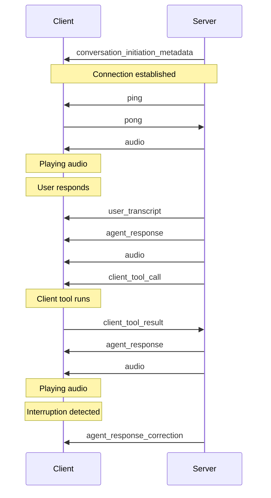

## Overview

Events are the foundation of real-time communication in conversational AI applications using WebSockets.
They facilitate the exchange of information like audio streams, transcriptions, agent responses, and contextual updates between the client application and the server infrastructure.

Understanding these events is crucial for building responsive and interactive conversational experiences.

Events are broken down into two categories:

<CardGroup cols={2}>
  <Card
    title="Client Events (Server-to-Client)"
    href="/conversational-ai/customization/events/client-events"
    icon="cloud-arrow-down"
  >
    Events sent from the server to the client, delivering audio, transcripts, agent messages, and
    system signals.
  </Card>
  <Card
    title="Client-to-Server Events"
    href="/conversational-ai/customization/events/client-to-server-events"
    icon="cloud-arrow-up"
  >
    Events sent from the client to the server, providing contextual updates or responding to server
    requests.
  </Card>
</CardGroup>
---
title: Client events
subtitle: >-
  Understand and handle real-time events received by the client during
  conversational applications.
---

**Client events** are system-level events sent from the server to the client that facilitate real-time communication. These events deliver audio, transcription, agent responses, and other critical information to the client application.

<Note>
  For information on events you can send from the client to the server, see the [Client-to-server
  events](/docs/conversational-ai/customization/events/client-to-server-events) documentation.
</Note>

## Overview

Client events are essential for maintaining the real-time nature of conversations. They provide everything from initialization metadata to processed audio and agent responses.

<Info>
  These events are part of the WebSocket communication protocol and are automatically handled by our
  SDKs. Understanding them is crucial for advanced implementations and debugging.
</Info>

## Client event types

<AccordionGroup>
  <Accordion title="conversation_initiation_metadata">
    - Automatically sent when starting a conversation
    - Initializes conversation settings and parameters

    ```javascript
    // Example initialization metadata
    {
      "type": "conversation_initiation_metadata",
      "conversation_initiation_metadata_event": {
        "conversation_id": "conv_123",
        "agent_output_audio_format": "pcm_44100",  // TTS output format
        "user_input_audio_format": "pcm_16000"    // ASR input format
      }
    }
    ```

  </Accordion>

  <Accordion title="ping">
    - Health check event requiring immediate response
    - Automatically handled by SDK
    - Used to maintain WebSocket connection

      ```javascript
      // Example ping event structure
      {
        "ping_event": {
          "event_id": 123456,
          "ping_ms": 50  // Optional, estimated latency in milliseconds
        },
        "type": "ping"
      }
      ```

      ```javascript
      // Example ping handler
      websocket.on('ping', () => {
        websocket.send('pong');
      });
      ```

  </Accordion>

  <Accordion title="audio">
    - Contains base64 encoded audio for playback
    - Includes numeric event ID for tracking and sequencing
    - Handles voice output streaming
    
    ```javascript
    // Example audio event structure
    {
      "audio_event": {
        "audio_base_64": "base64_encoded_audio_string",
        "event_id": 12345
      },
      "type": "audio"
    }
    ```

    ```javascript
    // Example audio event handler
    websocket.on('audio', (event) => {
      const { audio_event } = event;
      const { audio_base_64, event_id } = audio_event;
      audioPlayer.play(audio_base_64);
    });
    ```

  </Accordion>

  <Accordion title="user_transcript">
    - Contains finalized speech-to-text results
    - Represents complete user utterances
    - Used for conversation history

    ```javascript
    // Example transcript event structure
    {
      "type": "user_transcript",
      "user_transcription_event": {
        "user_transcript": "Hello, how can you help me today?"
      }
    }
    ```

    ```javascript
    // Example transcript handler
    websocket.on('user_transcript', (event) => {
      const { user_transcription_event } = event;
      const { user_transcript } = user_transcription_event;
      updateConversationHistory(user_transcript);
    });
    ```

  </Accordion>

  <Accordion title="agent_response">
    - Contains complete agent message
    - Sent with first audio chunk
    - Used for display and history

    ```javascript
    // Example response event structure
    {
      "type": "agent_response",
      "agent_response_event": {
        "agent_response": "Hello, how can I assist you today?"
      }
    }
    ```

    ```javascript
    // Example response handler
    websocket.on('agent_response', (event) => {
      const { agent_response_event } = event;
      const { agent_response } = agent_response_event;
      displayAgentMessage(agent_response);
    });
    ```

  </Accordion>

  <Accordion title="agent_response_correction">
    - Contains truncated response after interruption
      - Updates displayed message
      - Maintains conversation accuracy

    ```javascript
    // Example response correction event structure
    {
      "type": "agent_response_correction",
      "agent_response_correction_event": {
        "original_agent_response": "Let me tell you about the complete history...",
        "corrected_agent_response": "Let me tell you about..."  // Truncated after interruption
      }
    }
    ```

    ```javascript
    // Example response correction handler
    websocket.on('agent_response_correction', (event) => {
      const { agent_response_correction_event } = event;
      const { corrected_agent_response } = agent_response_correction_event;
      displayAgentMessage(corrected_agent_response);
    });
    ```

  </Accordion>

  <Accordion title="client_tool_call">
    - Represents a function call the agent wants the client to execute
    - Contains tool name, tool call ID, and parameters
    - Requires client-side execution of the function and sending the result back to the server

    <Info>
      If you are using the SDK, callbacks are provided to handle sending the result back to the server.
    </Info>

    ```javascript
    // Example tool call event structure
    {
      "type": "client_tool_call",
      "client_tool_call": {
        "tool_name": "search_database",
        "tool_call_id": "call_123456",
        "parameters": {
          "query": "user information",
          "filters": {
            "date": "2024-01-01"
          }
        }
      }
    }
    ```

    ```javascript
    // Example tool call handler
    websocket.on('client_tool_call', async (event) => {
      const { client_tool_call } = event;
      const { tool_name, tool_call_id, parameters } = client_tool_call;

      try {
        const result = await executeClientTool(tool_name, parameters);
        // Send success response back to continue conversation
        websocket.send({
          type: "client_tool_result",
          tool_call_id: tool_call_id,
          result: result,
          is_error: false
        });
      } catch (error) {
        // Send error response if tool execution fails
        websocket.send({
          type: "client_tool_result",
          tool_call_id: tool_call_id,
          result: error.message,
          is_error: true
        });
      }
    });
    ```

  </Accordion>

  <Accordion title="agent_tool_response">
    - Indicates when the agent has executed a tool function
    - Contains tool metadata and execution status
    - Provides visibility into agent tool usage during conversations

    ```javascript
    // Example agent tool response event structure
    {
      "type": "agent_tool_response",
      "agent_tool_response": {
        "tool_name": "skip_turn",
        "tool_call_id": "skip_turn_c82ca55355c840bab193effb9a7e8101",
        "tool_type": "system",
        "is_error": false
      }
    }
    ```

    ```javascript
    // Example agent tool response handler
    websocket.on('agent_tool_response', (event) => {
      const { agent_tool_response } = event;
      const { tool_name, tool_call_id, tool_type, is_error } = agent_tool_response;

      if (is_error) {
        console.error(`Agent tool ${tool_name} failed:`, tool_call_id);
      } else {
        console.log(`Agent executed ${tool_type} tool: ${tool_name}`);
      }
    });
    ```

  </Accordion>

  <Accordion title="vad_score">
    - Voice Activity Detection score event
    - Indicates the probability that the user is speaking
    - Values range from 0 to 1, where higher values indicate higher confidence of speech

    ```javascript
    // Example VAD score event
    {
      "type": "vad_score",
      "vad_score_event": {
        "vad_score": 0.95
      }
    }
    ```

  </Accordion>
</AccordionGroup>

## Event flow

Here's a typical sequence of events during a conversation:



### Best practices

1. **Error handling**

   - Implement proper error handling for each event type
   - Log important events for debugging
   - Handle connection interruptions gracefully

2. **Audio management**

   - Buffer audio chunks appropriately
   - Implement proper cleanup on interruption
   - Handle audio resource management

3. **Connection management**

   - Respond to PING events promptly
   - Implement reconnection logic
   - Monitor connection health

## Troubleshooting

<AccordionGroup>
  <Accordion title="Connection issues">

    - Ensure proper WebSocket connection
    - Check PING/PONG responses
    - Verify API credentials

  </Accordion>
  <Accordion title="Audio problems">

    - Check audio chunk handling
    - Verify audio format compatibility
    - Monitor memory usage

  </Accordion>
  <Accordion title="Event handling">
    - Log all events for debugging
    - Implement error boundaries
    - Check event handler registration
  </Accordion>
</AccordionGroup>

<Info>
  For detailed implementation examples, check our [SDK
  documentation](/docs/conversational-ai/libraries/python).
</Info>
---
title: Client to server events
subtitle: >-
  Send contextual information from the client to enhance conversational
  applications in real-time.
---

**Client-to-server events** are messages that your application proactively sends to the server to provide additional context during conversations. These events enable you to enhance the conversation with relevant information without interrupting the conversational flow.

<Note>
  For information on events the server sends to the client, see the [Client
  events](/docs/conversational-ai/customization/events/client-events) documentation.
</Note>

## Overview

Your application can send contextual information to the server to improve conversation quality and relevance at any point during the conversation. This does not have to be in response to a client event received from the server. This is particularly useful for sharing UI state, user actions, or other environmental data that may not be directly communicated through voice.

<Info>
  While our SDKs provide helper methods for sending these events, understanding the underlying
  protocol is valuable for custom implementations and advanced use cases.
</Info>

## Event types

### Contextual updates

Contextual updates allow your application to send non-interrupting background information to the conversation.

**Key characteristics:**

- Updates are incorporated as background information in the conversation.
- Does not interrupt the current conversation flow.
- Useful for sending UI state, user actions, or environmental data.

```javascript
// Contextual update event structure
{
  "type": "contextual_update",
  "text": "User appears to be looking at pricing page"
}
```

```javascript
// Example sending contextual updates
function sendContextUpdate(information) {
  websocket.send(
    JSON.stringify({
      type: 'contextual_update',
      text: information,
    })
  );
}

// Usage examples
sendContextUpdate('Customer status: Premium tier');
sendContextUpdate('User navigated to Help section');
sendContextUpdate('Shopping cart contains 3 items');
```

### User messages

User messages allow you to send text directly to the conversation as if the user had spoken it. This is useful for text-based interactions or when you want to inject specific text into the conversation flow.

**Key characteristics:**

- Text is processed as user input to the conversation.
- Triggers the same response flow as spoken user input.
- Useful for text-based interfaces or programmatic user input.

```javascript
// User message event structure
{
  "type": "user_message",
  "text": "I would like to upgrade my account"
}
```

```javascript
// Example sending user messages
function sendUserMessage(text) {
  websocket.send(
    JSON.stringify({
      type: 'user_message',
      text: text,
    })
  );
}

// Usage examples
sendUserMessage('I need help with billing');
sendUserMessage('What are your pricing options?');
sendUserMessage('Cancel my subscription');
```

### User activity

User activity events serve as indicators to prevent interrupts from the agent.

**Key characteristics:**

- Resets the turn timeout timer.
- Does not affect conversation content or flow.
- Useful for maintaining long-running conversations during periods of silence.

```javascript
// User activity event structure
{
  "type": "user_activity"
}
```

```javascript
// Example sending user activity
function sendUserActivity() {
  websocket.send(
    JSON.stringify({
      type: 'user_activity',
    })
  );
}

// Usage example - send activity ping every 30 seconds
setInterval(sendUserActivity, 30000);
```

## Best practices

1. **Contextual updates**

   - Send relevant but concise contextual information.
   - Avoid overwhelming the LLM with too many updates.
   - Focus on information that impacts the conversation flow or is important context from activity in a UI not accessible to the voice agent.

2. **User messages**

   - Use for text-based user input when audio is not available or appropriate.
   - Ensure text content is clear and well-formatted.
   - Consider the conversation context when injecting programmatic messages.

3. **User activity**

   - Send activity pings during periods of user interaction to maintain session.
   - Use reasonable intervals (e.g., 30-60 seconds) to avoid unnecessary network traffic.
   - Implement activity detection based on actual user engagement (mouse movement, typing, etc.).

4. **Timing considerations**

   - Send updates at appropriate moments.
   - Consider grouping multiple contextual updates into a single update (instead of sending every small change separately).
   - Balance between keeping the session alive and avoiding excessive messaging.

<Info>
  For detailed implementation examples, check our [SDK
  documentation](/docs/conversational-ai/libraries/python).
</Info>
